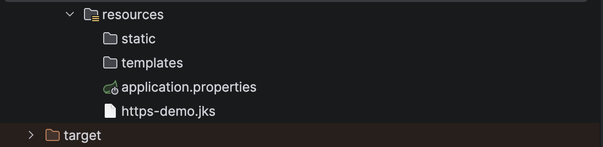
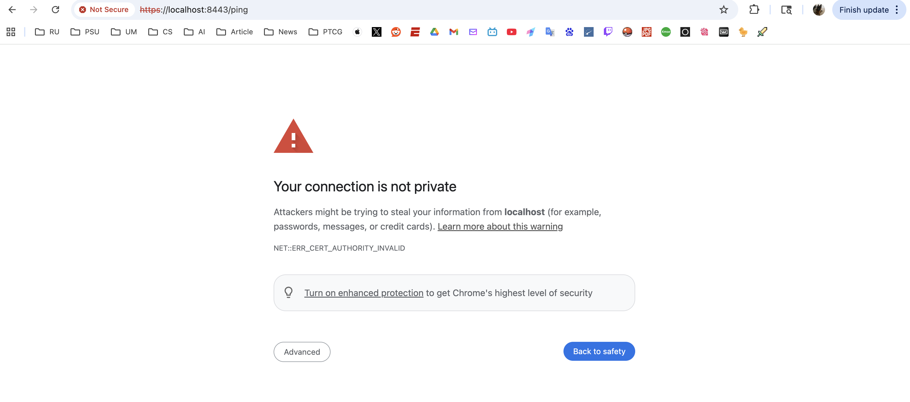
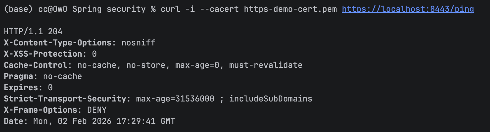
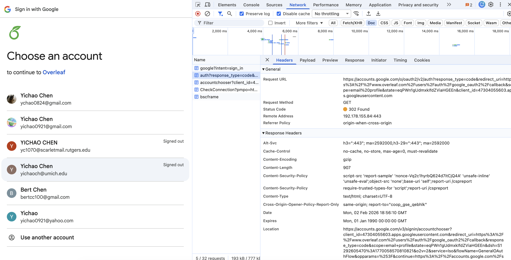
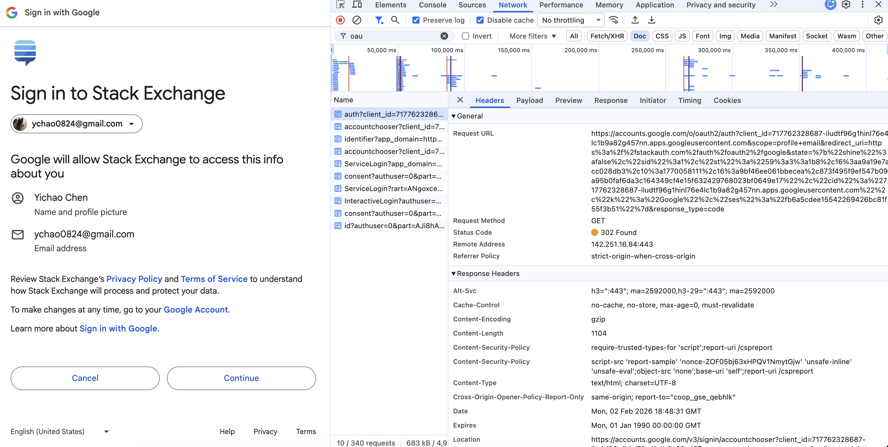

# Assignment12 Yichao Chen 

### Q1 List all of the annotations you learned from class and homework to annotaitons.md
### Q2 Explain TLS, PKI, certificate, public key, private key, and signature.
TLS (transport Layer security) create encrypted communication, data integrity and authentication between client and server.

PKI (public key infrastructure) is a system of hardware, software, policies, and procedures used to create, manage, distribute, and revoke digital certificates and public keys.

Certificate is an electronic document binds a public key to an identity and sign by Certification Authority (CA).

Private key is a cryptographic key that can be shared openly and is used to encrypt data or verify digital signatures.

Public key is a secret cryptographic key kept by the owner and is used to decrypt data or create digital signatures.

Signature is a cryptographic mechanism that uses a private key to ensure message authenticity, integrity, and non-repudiation.
### Q3 Write a Spring security based application, which provides https APIs (one simple get controller with empty response is good enough )instead of http, please generate a self-signed certificate to make your https TLS verfication work.



### Q4 List all http status codes that related to authentication and authorization failures.
401 Unauthorized
Indicates that the request requires user authentication or the authentication credentials are missing or invalid.

403 Forbidden
Indicates that the server understood the request but refuses to authorize it, even though the user is authenticated.

407 Proxy Authentication Required
Indicates that the client must authenticate itself with a proxy before the request can be processed.

440 Login Timeout
Indicates that the user's session has expired and re-authentication is required (commonly used by Microsoft IIS).

### Q5 Compare authentication and authorization? Name and explain important components in Spring security that undertake authentication and authorization
Authentication is the process of verifying who a user is, typically by validating credentials such as username and password.

Authorization is the process of determining what an authenticated user is allowed to do, such as accessing specific resources or performing certain actions.

### Q6 Explain HTTP Session?
Http session is a server-side mechanism used to maintain state between multiple request from same client. Http is a stateless protocol, a session allows the server to store user-specific data. 

### Q7 Explain Cookie?
A cookie is a small piece of data stored on the client’s browser that is sent to the server with each HTTP request.
### Q8 Compare Session and Cookie?
A session is a server-side mechanism used to store user-specific data across multiple HTTP requests.

### Q9 Find at least TWO websites who can be logged in using your Google Account, explain in detail on how Google SSO works with screenshots like below, find SSO-related Rest calls in Chrome developer tool:



### Q10 How do we use session and cookie to keep user information across the the application?
When a user logs in, the server creates a session and stores user information in it.

A session ID is sent to the client as a cookie, and the client includes this cookie in subsequent requests.

The server reads the session ID from the cookie, locates the session, and restores the user’s information for each request.

### Q11 What is the spring security filter?
Spring Security filter is a chain of servlet filters that intercepts every HTTP request to perform security-related operations such as authentication and authorization.
### Q12 Explain bearer token and how JWT works.
A bearer token is an access token that grants authorization to the client that presents it. The server does not verify who holds the token, only whether the token is valid.

JWT is a compact, URL-safe token format used to securely transmit information between parties. JWT is used as a bearer token. JWT consists of three parts: 1.Header 2. Payload 3.signature

### Q13 Explain how do we store sensitive user information such as password and credit card number in DB?
Passwords must be stored using one-way hashing algorithms with salt.

Credit card numbers should be encrypted using strong symmetric encryption.
### Q14 Compare UserDetailService, AuthenticationProvider, AuthenticationManager, AuthenticationFilter?(把这⼏个名字看熟悉也⾏)
AuthenticationFilter intercepts incoming HTTP requests and extracts credentials (e.g., username/password, Bearer token). It then creates an Authentication object and passes it to the AuthenticationManager.\
AuthenticationManager is the central entry point for authentication. It receives an Authentication request from the filter and delegates the actual verification work to one or more AuthenticationProviders.\
AuthenticationProvider performs the real authentication logic. It checks whether it supports the given Authentication type and validates credentials. If authentication succeeds, it returns a fully authenticated Authentication object.\
UserDetailsService loads user information (username, password hash, roles/authorities) from a user store such as a database. It is commonly used by an AuthenticationProvider (e.g., DaoAuthenticationProvider) during username/password authentication.
### Q15 What is the disadvantage of Session? how to overcome the disadvantage?
Sessions introduce server-side state, which reduces scalability and increases resource usage. If the server storing the session crashes, session data may be lost.Sessions are stored on the server, so each user consumes server memory. In distributed systems, sessions must be shared or synchronized across multiple servers.

### Q16 How to get value from application.properties in Spring security?
The @Value annotation injects values from application.properties into Spring-managed beans.
```java
@Value("${spring.security.user.name}")
private String username;

@Value("${spring.security.user.password}")
private String password;

```
@ConfigurationProperties binds a group of related properties to a Java object.

Add `security.jwt.secret=my-secret-key`, `security.jwt.expiration=3600` to application.properties


```java
@Component
@ConfigurationProperties(prefix = "security.jwt")
public class JwtProperties {

    private String secret;
    private int expiration;

    // getters and setters
}
```
The Environment object provides programmatic access to application properties.
```java
@Autowired
private Environment environment;

public void example() {
    String secret = environment.getProperty("security.jwt.secret");
}

```
### Q17 What is the role of configure(HttpSecurity http) and configure(AuthenticationManagerBuilder auth)?
Configure(HttpSecurity http) is used to define web-level security rules, such as authentication requirements.
* Which URLs require authentication
* Which URLs are publicly accessible
* Authorization rules (roles/permissions)
* Login method (form login, HTTP Basic, OAuth)
* Logout configuration
* CSRF, CORS, session management
* Security headers

Configure(AuthenticationManagerBuilder auth) is used to define how authentication is performed and where user credentials come from.
* User source (in-memory, database, LDAP)
* Password encoding strategy
* AuthenticationProvider configuration
* Custom UserDetailsService

### Q18 Reading 
### Q19 Explain best practices to securely store secrets in applications.

To securely store secrets, avoid hard-coding them in code or repositories and inject them at runtime via environment variables or secret managers. Protect secrets with encryption at rest, strict access control, and separate key management (KMS/HSM). Rotate secrets regularly, prefer short-lived credentials, and prevent leakage through logs or insecure transport by enforcing HTTPS and masking sensitive data.

