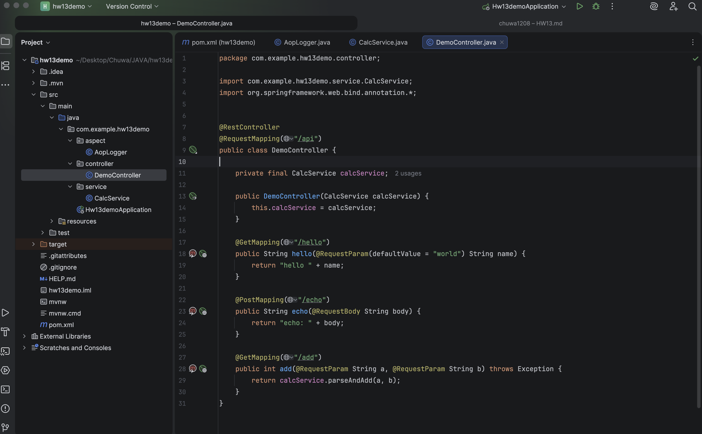
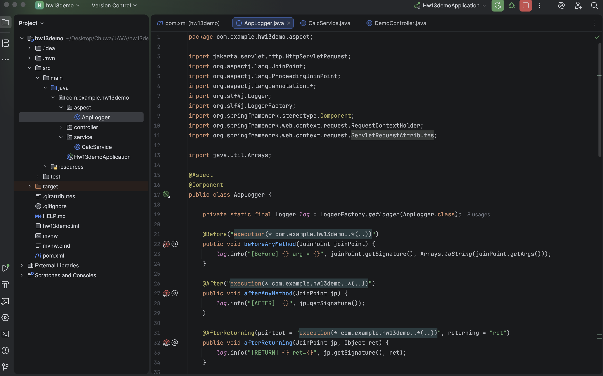
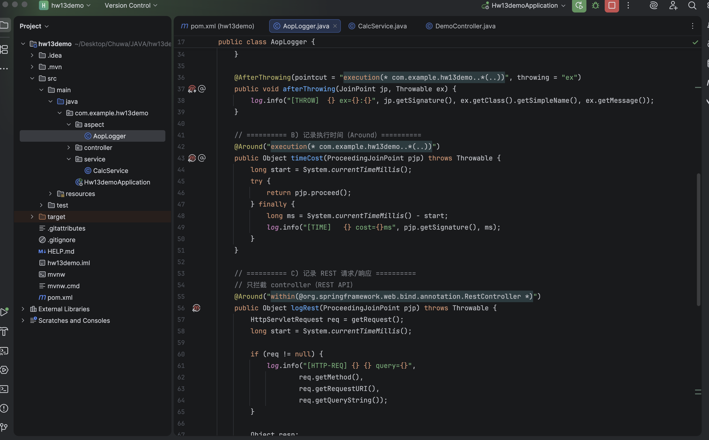
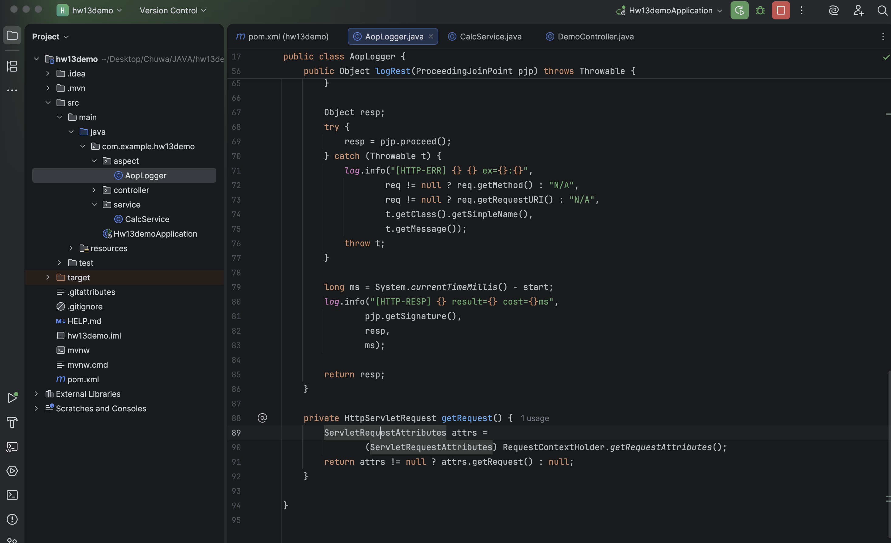
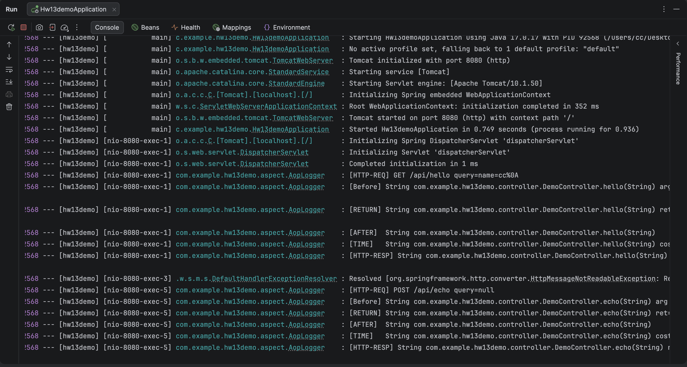

# Assignment 13 Yichao Chen

### Q1 List all of the annotations you learned from class and homework to annotaitons.md
### Q2 What is Aspect Oriented Programming, what does "aspect" mean? Explain its use cases in detail?
Aspect-Oriented Programming (AOP) is a programming paradigm that aims to increase modularity by separating cross-cutting concerns from core business logic. An aspect represents a modular unit of a cross-cutting concern. It encapsulates both what should be done (the advice, such as code to run before or after a method) and where it should be applied (the pointcut, which defines the join points in the program). In other words, an aspect is a special module that intercepts the execution of methods and injects additional behavior without modifying the original source code.
### Q3 What are the advantages and disadvantages of Spring AOP?
Advantages of spring AOP: Improve the separation of concerns and reduced code duplication, better modularity and reusability.
Disadvantages of spring AOP: Only support method-join points. Also, increase debugging complexity.
### Q4 Compare Spring AOP vs Java Reflection vs Spring Interceptor.
AOP is framework solution that intercepts method execution by spring - managed beans and handling logging and security. However, Java reflection is low level programming allowing runtime inspecting, it will cost performance. Spring interceptor is handle https request making it suitable for request-based concerns like authentication, logging, and request preprocessing, but not for general service-layer method interception.
### Q5 Explain following concept in your own words, you may include code snippet as part of your answer.
Aspect: it is classic contain logic which should applied across of multiple applications, such as logging and security.
```java
@Aspect
@Component
public class LogAspect() {
}
```
PointCut: A PointCut defines which method or execution will should be intercepted by an aspect.
```java
@PointCut("exection(* com.example.service.*.*(..))")
public void serviceMethod() {}
```
JoinPoint: A JoinPoint represents a specific point during program execution where an aspect can be applied, such as a method execution. I
```java
@Before("serviceMethod()")
public void log(JoinPoint joinPoint) {
    System.out.println(joinPoint.getSignature().getName());
}
```
Advice: Advice is the actual code that runs when a pointcut matches a join point. It defines what action should be taken and when it should be executed, such as before, after, or around a method call.
```java
@Before("serviceMethods()")
public void beforeAdvice() {
    System.out.println("Before method execution");
}
```
### Q6 How do we declare a pointcut, can we declare it without annotating an empty method? Name some expressions to do it.
In Spring AOP, a pointcut can be declared using a pointcut expression that defines which join points should be matched. The most common way is to use the `@Pointcut` annotation on an empty method, where the method name serves as a reusable reference to the expression. Yes, a pointcut can be declared without annotating an empty method. Instead, the pointcut expression can be written directly inside advice annotations such as @Before, @After, or @Around. This approach is simpler but less reusable.
```java
@Before("execution(* com.example.service.*.*(..))")
public void beforeAdvice() {
}
```
### Q7 Compare different types of advices in Spring AOP.
Spring AOP provides several types of advices that define when cross-cutting logic is executed relative to a target method. Each advice type serves a different purpose and offers a different level of control over method execution.

`@Before` advice runs before the target method is executed and is commonly used for tasks such as input validation, authorization checks, or logging method entry. It cannot prevent the target method from running.

`@After` advice runs after the target method completes regardless of whether it returns normally or throws an exception, making it similar to a finally block. It is often used for cleanup operations.

`@AfterReturning` advice executes only after the target method successfully returns a result and allows access to the returned value, which makes it suitable for result logging or post-processing.

`@AfterThrowing` advice runs only when the target method throws an exception and is typically used for exception logging or error handling.

`@Around` advice is the most powerful type because it wraps the entire method execution. It runs both before and after the method and can control whether the method executes at all by invoking or skipping proceed(). This makes it ideal for performance monitoring, transactions, and advanced security logic.
### Q8 On top of your Spring application (you may create a new one or use your previous project),




